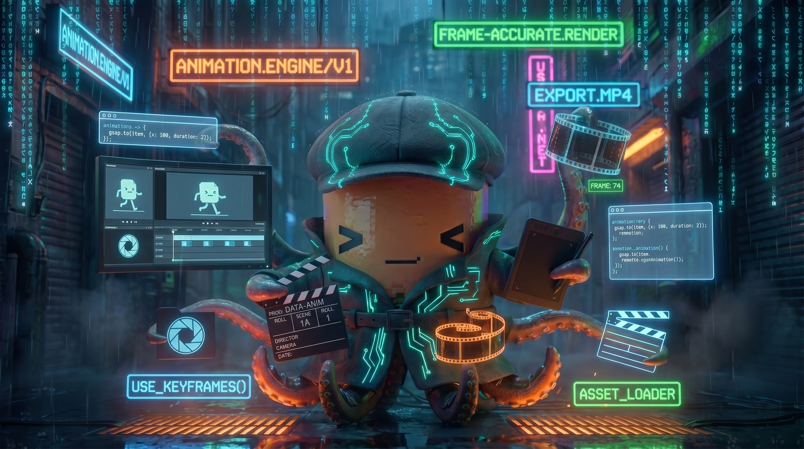

# claude-design-to-video (macOS + Linux)



> **Claude Design HTML export → MP4 video** — deterministic frame-by-frame rendering via timecut.

Claude Design (Anthropic Labs) exports animated prototypes as **standalone HTML** (React + Babel + JSX scenes). This skill converts that export to an MP4 video without frame drops, glitches, or quality loss — ready for YouTube, Instagram, LinkedIn, or anywhere else.

---

## ⚠️ Security note

This skill **executes arbitrary JavaScript from the bundle in your local Chrome** and serves files over `localhost`. Only render **trusted exports** (your own or from a known source). A bundle from a stranger = arbitrary code execution on your machine. Treat it like running any unknown script.

---

## Why this skill exists

Recording a Claude Design animation with Playwright/Puppeteer/OBS **doesn't work**. Browsers render frames when they can, skip frames under load, and tie animations to wall-clock time. If a screenshot takes 200 ms but your animation expects 16 ms frames, you get a stuttery mess.

**timecut** solves this by **virtualizing time** — it overrides `requestAnimationFrame`, `setTimeout`, `Date.now`, and `performance.now` inside the browser, then renders each frame at its exact virtual timestamp. Screenshots can take as long as they need; the resulting video is perfectly smooth.

The skill also **auto-patches known CSS bugs** in Claude Design exports (scrubber, blink keyframes, fade transitions, webcam idle motion) before rendering — so you don't need to hand-edit the export.

---

## What you get

- **MP4 output**, 1920×1080 @ 30 fps by default (or 4K, plus custom fps via `--fps`)
- **YouTube-grade quality** — H.264, yuv420p, CRF 18, preset slow
- **Zero drop frames** — every frame rendered deterministically
- **Auto-patched CSS bugs** with a change report — see [Auto-patches](#auto-patches) below
- **Clean workspace** — temp files and copied bundle deleted via `trap` after every run
- **Persistent timecut cache** (~150 MB in `~/.cache/claude-design-to-video/`) reused across runs

---

## Platform support

| OS | Status |
|---|---|
| **macOS** (Intel + Apple Silicon) | ✅ Main-tested |
| **Linux** (Debian/Ubuntu/Arch) | ✅ Should work (community-tested — feedback welcome) |
| **Windows** | ❌ Not supported natively. Use [WSL2](https://learn.microsoft.com/en-us/windows/wsl/install) with a Linux distro inside. |

The skill relies on bash/POSIX tools (`mktemp`, `trap`, `pkill`, `open`/`xdg-open`). Windows PowerShell can't run this flow as-is. A native Windows branch is in the roadmap but low priority — WSL2 solves it today.

---

## Requirements

| Tool | Minimum | Check |
|---|---|---|
| **Claude Code** | latest | skill loads via `.claude/skills/` |
| **ffmpeg** | ≥ 4 | `ffmpeg --version` |
| **Node.js** | ≥ 18 | `node --version` |
| **Python 3** | ≥ 3.8 | `python3 --version` (for HTTP server) |
| **Chrome / Chromium** | any recent | auto-detected on macOS / Linux |

First run installs `timecut@0.3.3` (pinned) — cached in `~/.cache/claude-design-to-video/timecut/`, ~150 MB, reused forever.

---

## Installation

### Option A — manual copy (easiest)

```bash
git clone https://github.com/Szewowsky/claude-design-to-video.git
cp -R claude-design-to-video/skill ~/.claude/skills/claude-design-to-video
```

Restart Claude Code. The skill appears as `/claude-design-to-video`.

### Option B — `.skill` package

Download `claude-design-to-video.skill` from the [releases page](https://github.com/Szewowsky/claude-design-to-video/releases), then install via Claude Code's skill installer.

---

## Quick start

### 1. Export your animation from Claude Design
Share → **Download standalone HTML**. You'll get a folder like:

```
My Animation/
├── index.html          # React + Babel entry
├── animations.jsx      # <Stage>, useTime, useTimeline engine
├── scenes/             # individual scene components
└── assets/             # images, fonts
```

### 2. Call the skill

```
You: wyrenderuj mi animację z Downloads/My Animation
```

or explicitly:

```
You: /claude-design-to-video "~/Downloads/My Animation"
```

### 3. Wait
- **Preview** (15 s): ~1 min
- **Full 74 s @ 1080p30 fast:** ~10 min
- **Full 74 s @ 1080p30 HQ:** ~15 min
- **Full 74 s @ 4K30 HQ:** ~40–60 min

Output lands in `~/Downloads/<slug>-<WxH>-<fps>-<mode>.mp4`, auto-opens in your default player (QuickTime on macOS, xdg-open on Linux).

---

## Flags

| flag | effect | default |
|---|---|---|
| `--hq` | CRF 18, preset slow (YouTube source grade) | ✓ on |
| `--fast` | CRF 20, preset medium (iteration, -30% time) | off |
| `--preview N` | render only first N seconds (quick check) | off |
| `--4k` | 3840×2160 (default 1920×1080) | off |
| `--fps N` | frame rate | 30 |
| `--duration N` | override parsed duration (required if bundle has no `DURATION = N`) | auto |
| `--no-patch` | skip auto-patch CSS (if bundle is already clean) | off |
| `--in-place` | patch the original folder instead of a temp copy | off (safer) |
| `--output PATH` | override output location | `~/Downloads/...` |

---

## Auto-patches

Claude Design exports contain CSS timing that breaks frame-by-frame capture (timecut controls JS time only, not CSS `@keyframes` or `transition:`). The skill auto-detects and rewrites these patterns before rendering, then shows a **change report** so you can see exactly what got modified:

| Pattern | Fix |
|---|---|
| `<PlaybackBar>` scrubber in `<Stage>` | Hidden via `?render=1` URL flag |
| `@keyframes blink` + `animation: 'blink Ns infinite'` | JS `opacity` from `useTime()` with linear fade |
| `transition: opacity Nms cubic-bezier` on webcam | JS ease-out cubic interpolation |
| Webcam idle motion (`sway`, `breathe` via `Math.sin`) | Disabled (subpixel jitter looks bad in pre-rendered video) |

Patches apply to a **copy** of your bundle in a temp dir by default — the original stays untouched. Use `--in-place` to modify the original folder directly. Use `--no-patch` if your bundle is already clean or you've patched it yourself.

Unknown patterns → skipped silently (render proceeds, you can hand-fix if needed). New patterns can be added to the skill's patch list over time.

---

## Known limitations

- **CSS transitions with dynamic layout** (e.g. `transition: flex 600ms cubic-bezier`) aren't auto-patched — flex interpolation requires knowing final dimensions, too risky. If you hit one, port it to JS `interpolate()` manually.
- **Intel Macs** render ~1.5–2× slower than Apple Silicon.
- **Windows** — see [Platform support](#platform-support).

---

## Troubleshooting

See the **Failure modes** table in [`skill/SKILL.md`](skill/SKILL.md) — covers port conflicts, Chrome timeouts, mid-render crashes, offline npm install, frame count mismatches, and missing `DURATION`.

---

## How it works under the hood

```
1. Preflight       → check ffmpeg, Chrome, Node, Python3
2. Locate bundle   → arg or autodetect in ~/Downloads/ (via Python — portable)
3. Parse metadata  → DURATION, viewport from the entry HTML
4. Setup workspace → temp copy (default) or in-place, trap cleanup both modes
5. Auto-patch CSS  → 4 known bugs fixed silently, change report at the end
6. Install timecut → pinned @0.3.3, cached (~150 MB, one-time)
7. Serve bundle    → python3 http.server on random port, retry loop
8. Render          → timecut → PNG frames → ffmpeg → MP4
9. Cleanup (trap)  → kill HTTP server + render + child processes, rm -rf temp
10. Report + open  → ffprobe stats, frame-count validation, open in player
```

Full flow lives in [`skill/SKILL.md`](skill/SKILL.md).

---

## Credits

- **[timecut](https://github.com/tungs/timecut)** by Steve Tung — the virtualized-time browser rendering engine that makes this possible.
- **ffmpeg** — for the final encode.
- **Anthropic** — for Claude Design.

---

## License

MIT — see [LICENSE](LICENSE).

---

## Contributing

Issues and PRs welcome. Especially interested in:
- New CSS pattern auto-patches (as Claude Design export evolves)
- Linux distro compatibility reports (tested on which distros?)
- Performance improvements (parallel render? canvas capture mode?)
- Native Windows branch (PowerShell equivalent)
